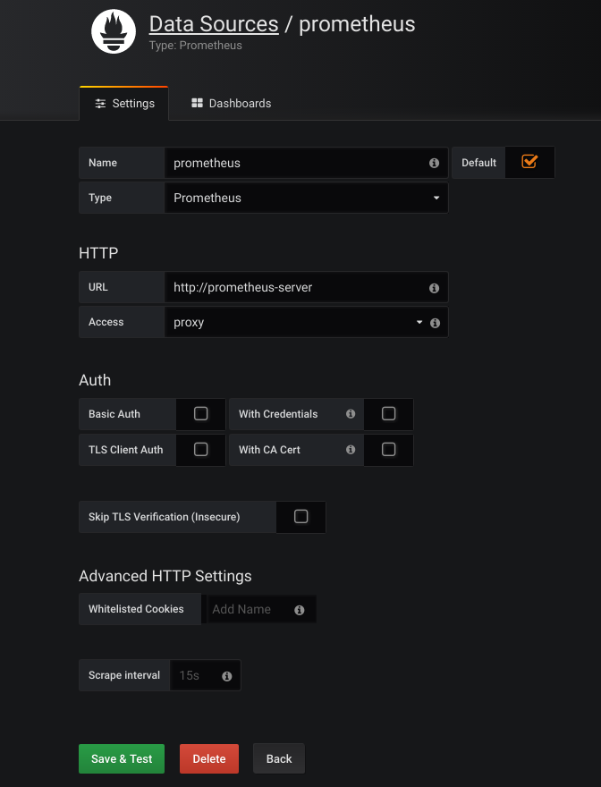
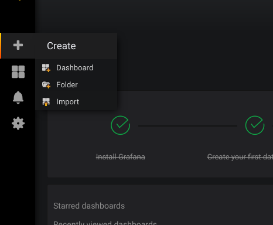
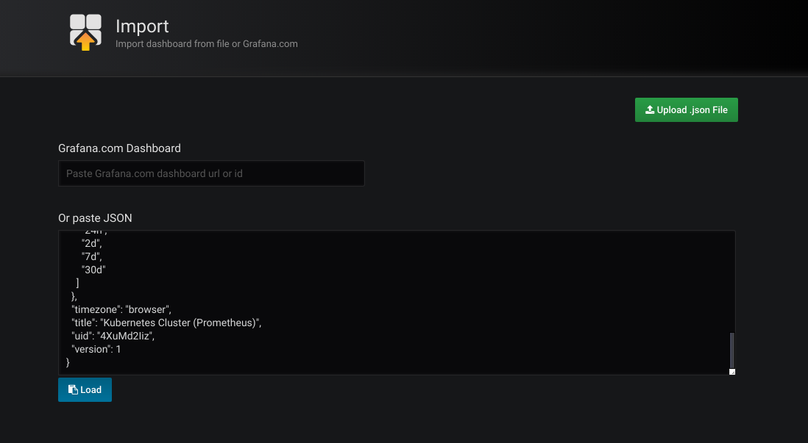
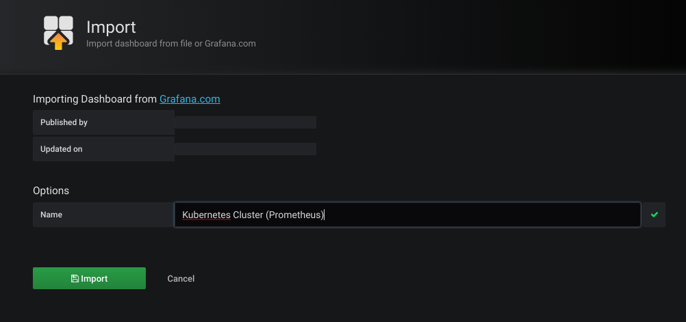
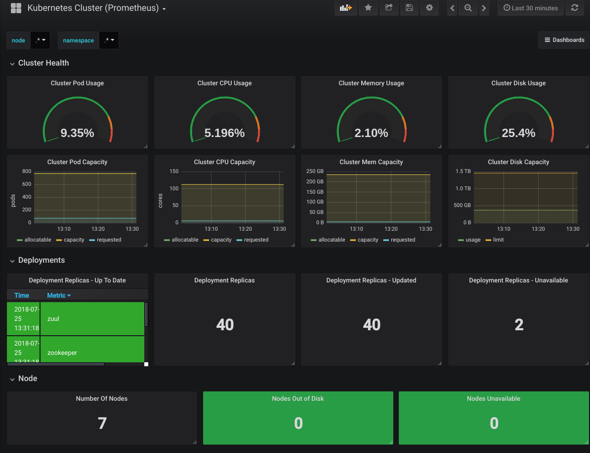

# prometheus

## 概念以及介绍

### 概念
 
Prometheus 是源于 Google Borgmon 的一个系统监控和报警工具，用 Golang 语言开发。基本原理是通过 HTTP 协议周期性地抓取被监控组件的状态（pull 方式），这样做的好处是任意组件只要提供 HTTP 接口就可以接入监控系统，不需要任何 SDK 或者其他的集成过程。
 
这样做非常适合虚拟化环境比如 VM 或者 Docker ，故其为为数不多的适合 Docker、Mesos 、Kubernetes 环境的监控系统之一，被很多人称为下一代监控系统。
 
### pull 方式
 
Prometheus 采集数据用的是 pull 也就是拉模型,通过 HTTP 协议去采集指标，只要应用系统能够提供 HTTP 接口就可以接入监控系统，相比于私有协议或二进制协议来说开发简单。
 
### push 方式
 
对于定时任务这种短周期的指标采集，如果采用 pull 模式，可能造成任务结束了 Prometheus 还没有来得及采集的情况，这个时候可以使用加一个中转层，客户端推数据到 Push Gateway 缓存一下，由 Prometheus 从 push gateway pull 指标过来。
 
### 组成及架构
 
+ Prometheus server：主要负责数据采集和存储，提供 PromQL 查询语言的支持；
+ Push Gateway：支持临时性 Job 主动推送指标的中间网关；
+ exporters：提供被监控组件信息的 HTTP 接口被叫做 exporter ，目前互联网公司常用的组件大部分都有 exporter 可以直接使用，比如 Varnish、Haproxy、Nginx、MySQL、Linux 系统信息 (包括磁盘、内存、CPU、网络等等)；
+ PromDash：使用 rails 开发的 dashboard，用于可视化指标数据；
+ WebUI：9090 端口提供的图形化功能；
+ alertmanager：实验性组件、用来进行报警；
+ APIclients：提供 HTTPAPI 接口


## prometheus 安装

使用容器安装

### 安装前提

+ kubernetes 集群
+ kubernetes helm 部署完成
+ registry 镜像准备
    - prom/alertmanager:v0.14.0
    - jimmidyson/configmap-reload:v0.1
    - registry.xonestep.com/google_containers/kube-state-metrics:v1.2.0
    - prom/pushgateway:v0.4.0
    - prom/prometheus:v2.2.1
    - busybox:latest
    
### 安装

下载 helm chat prometheus-6.2.1.tgz

由于prometheus服务需要2块容器卷，既 persistent volume，首先先创建PV

此案例使用rbd卷

1: 先在rbd服务器创建2块rbd盘
```
rbd create test-prometheus-alertmanager --size 2048 --pool newtouchone
rbd create test-prometheus-server --size 8192 --pool newtouchone

```

2: 在kubernetes master 服务器创建 rbd secret

```
cat >kube-system-ceph-secret.yaml <<EOF
apiVersion: v1
kind: Secret
metadata:
    name: kube-system-ceph-secret
    namespace: kube-system
data:
    key: QVFETHJXMVlPN21uRVJBQUtMVzJueWVUdmw5azlaU29MZnlaR1E9PQ==
EOF

kubectl apply -f kube-system-ceph-secret.yaml

```

3: 创建 prometheus-容器卷


```
cat >prometheus-pv.yaml <<EOF
apiVersion: v1
kind: PersistentVolume
metadata:
  labels:
    app: prometheus
    chart: prometheus-6.2.1
    component: alertmanager
    heritage: Tiller
    release: prometheus
  name: prometheus-alertmanager
spec:
  capacity:
    storage: 2Gi
  accessModes:
    - ReadWriteOnce
  persistentVolumeReclaimPolicy: Retain
  rbd:
    monitors:
      - 10.21.0.101:6789
      - 10.21.0.102:6789
      - 10.21.0.103:6789
    pool: newtouchone
    image: test-prometheus-alertmanager
    user: admin
    secretRef:
        name: kube-system-ceph-secret
    fsType: ext4
    readOnly: false
---
apiVersion: v1
kind: PersistentVolume
metadata:
  labels:
    app: prometheus
    chart: prometheus-6.2.1
    component: server
    heritage: Tiller
    release: prometheus
  name: prometheus-server
spec:
  capacity:
    storage: 8Gi
  accessModes:
    - ReadWriteOnce
  persistentVolumeReclaimPolicy: Retain
  rbd:
    monitors:
      - 10.21.0.101:6789
      - 10.21.0.102:6789
      - 10.21.0.103:6789
    pool: newtouchone
    image: test-prometheus-server
    user: admin
    secretRef:
        name: kube-system-ceph-secret
    fsType: ext4
    readOnly: false
EOF

kubectl apply -f prometheus-pv.yaml

```

4: 使用helm 安装 prometheus
```$xslt
helm install --name prometheus prometheus-6.2.1.tgz --namespace kube-system --set kubeStateMetrics.image.repository=registry.xonestep.com/google_containers/kube-state-metrics
```

# Grafana

## 概念和介绍

Grafana 是一个开源的时序性统计和监控平台，支持例如 elasticsearch、graphite、influxdb 等众多的数据源，并以功能强大的界面编辑器著称。


### 安装前提
+ kubernetes 集群
+ kubernetes helm 部署完成
+ registry 镜像准备
    - grafana/grafana:5.0.4
## 安装    

下载 helm grafana-1.2.0.tgz

由于grafana程序有内置数据库，为保证数据不丢失需要提供一块容器卷

此案例使用rbd卷

1: 先在rbd服务器创建1块rbd盘
```
rbd create test-grafana --size 10240 --pool newtouchone
```

2: 在kubernetes master 服务器创建 rbd secret

```
cat >kube-system-ceph-secret.yaml <<EOF
apiVersion: v1
kind: Secret
metadata:
    name: kube-system-ceph-secret
    namespace: kube-system
data:
    key: QVFETHJXMVlPN21uRVJBQUtMVzJueWVUdmw5azlaU29MZnlaR1E9PQ==
EOF

kubectl apply -f kube-system-ceph-secret.yaml

```

3: 创建 grafana 的容器卷(pv,pvc)

```
cat >grafana-pv.yaml<<EOF
apiVersion: v1
kind: PersistentVolume
metadata:
  labels:
    app: grafana
    chart: grafana-1.2.0
    heritage: Tiller
    release: grafana
  name: grafana
spec:
  capacity:
    storage: 10Gi
  accessModes:
    - ReadWriteOnce
  persistentVolumeReclaimPolicy: Retain
  rbd:
    monitors:
      - 10.21.0.101:6789
      - 10.21.0.102:6789
      - 10.21.0.103:6789
    pool: newtouchone
    image: test-grafana
    user: admin
    secretRef:
        name: kube-system-ceph-secret
    fsType: ext4
    readOnly: false

EOF

cat >grafana-pvc.yaml <<EOF
apiVersion: v1
kind: PersistentVolumeClaim
metadata:
  labels:
    app: grafana
    chart: grafana-1.2.0
    heritage: Tiller
    release: grafana
  name: grafana
  namespace: kube-system
spec:
  accessModes:
  - ReadWriteOnce
  resources:
    requests:
      storage: 10Gi
  selector:
    matchLabels:
      app: "grafana"
EOF

kubectl apply -f grafana-pv.yaml -f grafana-pvc.yaml
```

4: 使用helm 安装grafana
```
helm install grafana-1.2.0.tgz --name grafana --namespace kube-system --set adminPassword=admin
```

5: grafana 访问配置

使用nginx ingress 或 service nodePort方式配置访问grafana

6: grafana 配置dashboard 监控面板

- a: 进入grafana 登录页面，用户名为admin,密码为helm安装时设置`adminPassword`的密码,本案例为(admin)


- b: 点击datasource 配置数据源配置页面

    name: 填写 prometheus
    
    type: 选择 Prometheus
    
    HTTP: URL 填写 http://prometheus-server
    
    点击 Save & Test
    

    
- c: 创建dashboard

    点击左侧菜单 CREATE -- Import
 
     
    在 paste JSON 填写 [dashboard.json](prometheus_img/health_check.json)内容


 - 点击Load 进入确认页面


 - 点击Import 进行保存

 - 在首页就可以看到kubernetes 集群监控状态
 
 
此监控的指标有 
    
- 集群Pod使用百分比
- 集群cpu使用百分比
- 集群内存使用百分比
- 集群硬盘使用百分比
- 集群Pod容量
- 集群cpu容量
- 集群内存容量
- 集群硬盘容量
- 最近部署
- 部署副本数
- 部署副本更新数
- 部署副本更新失败数
- 集群节点数
- 集群节点磁盘不足数
- 集群节点不可用数
- 集群pod数量
- 集群pod 阻塞中数量
- 集群pod 失败数量
- 集群pod 成功退出数量
- 集群pod 未知状态数量
- 容器运行中数量
- 容器等待中数量
- 容器停止中数量
- 容器重启数量
- 容器CPU请求数量
- 容器内存请求数量
- job 执行成功数量
- job 失败数量

    